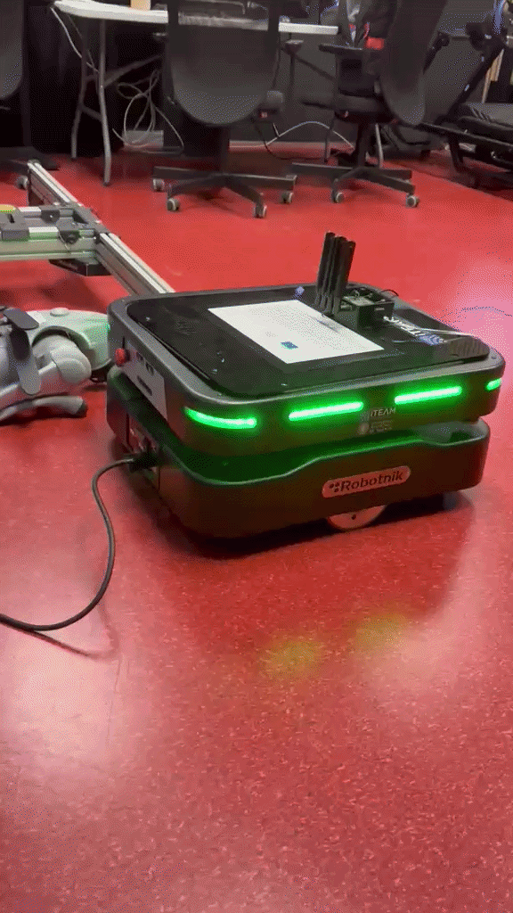

# Test  
Since I switched from an RB-SUMMIT robot to an RB-THERON robot, I first tried to understand the differences between these two robots; I didn’t want to make any mistakes while operating it without understanding how it works. All this information is detailed in the *Difference_RB-SUMMIT_RB-THERON* section.  

However, since that wasn’t enough to understand how to operate my robot, I asked Claude to list the available topics for me and tell me what it was capable of doing.  

### Checking the robot's status via the LLM  
Claude also successfully reported the robot's status to me: its current position and the laser scan data. Before executing a command, I often asked Claude whether the robot could move forward or if an obstacle was blocking its path, in order to verify the accuracy of the lasers. If the answer was yes, I would ask him how far away the obstacle was.  

### Controlling the robot using natural language / basic navigation task  
Executing commands to move in a straight line for a certain distance proved successful.  

However, when I asked it to move backward, it did not interpret the command as I had expected. I wanted it to move backward using reverse gear, but it chose instead to turn and move forward.  

The command here was sent using `navigate_to_pose` (a continuous local controller is used, allowing the speed to be recalculated in a loop at each cycle). It is configured with `min_vel_x = 0.0`; structurally, it can never generate a negative speed, which is why it turns around.  

However, my robot was able to move backward using the cmd_vel command, because in this case a raw velocity is sent directly to the wheels, and there are no safety measures in place to avoid obstacles. When using this command, Claude proved to be very protective, ensuring that there was no risk of encountering an obstacle during movement.  

The robot also performed well when I asked it to go to a specific set of coordinates.  

### Conclusion
During these tests, I only made small movements of up to 1 meter.
Claude performed very well, both when commands were successful and when they failed, because he explains in great detail exactly what he’s doing or what isn’t working, as well as possible solutions.

